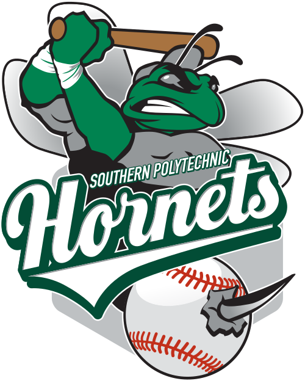
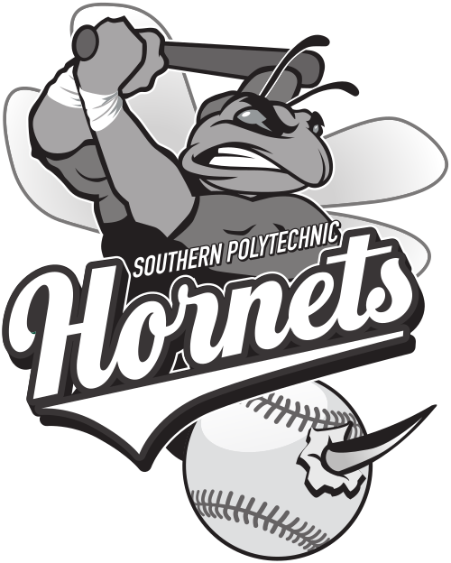
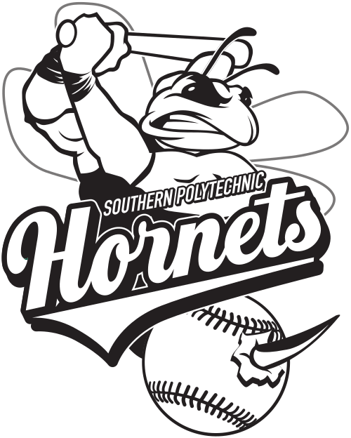
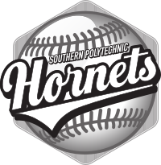

# SPSU Baseball 

Each logo style is available in `svg`, `eps` and `png` formats. Click the link in the table heading to be taken to the
appropriate directory. The `png` images are sized for use in this `README`, please use either the `svg` or `eps` 
formats to maintain resolution in an actual application.

## Ligature

| [Regular](Ligature) | [Gray Scale](Ligature) | [Line](Ligature) |
| ------------- | ------------- | ------------- |
|  |  |  |

## Hornet

| [Regular](Hornet) | [Gray Scale](Hornet) | [Line](Hornet) |
| ------------- | ------------- | ------------- |
|  |  |  |

## Script

| [Regular](Script) | [Gray Scale 1](Script) | [Gray Scale 2](Script) | [Line](Script) |
| ------------- | ------------- | ------------- | ------------- |
|  |  |  |  |

| [Alternate](Script) |
| ------------------- |
|  |
