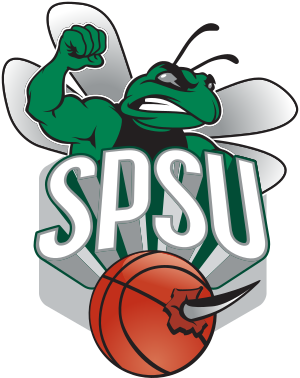
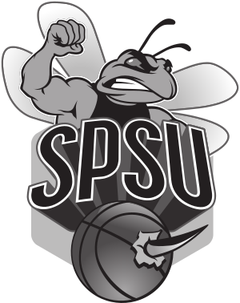
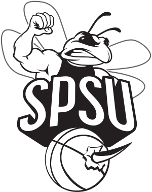
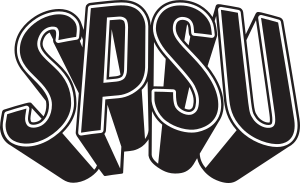
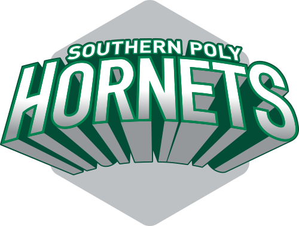
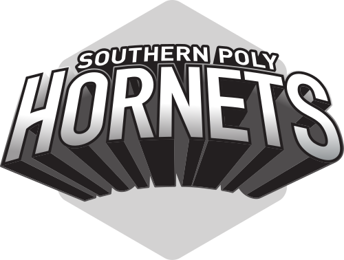
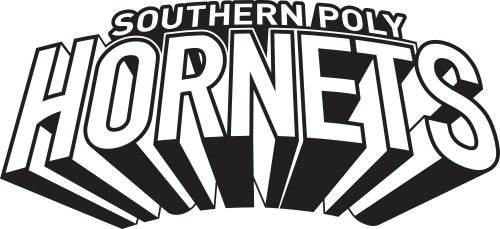

# SPSU Basketball 

Each logo style is available in `svg`, `eps` and `png` formats. Click the link in the table heading to be taken to the
appropriate directory. The `png` images are sized for use in this `README`, please use either the `svg` or `eps` 
formats to maintain resolution in an actual application.

## Hornet

| [Regular](Hornet) | [Gray Scale](Hornet) | [Line](Hornet) |
| ------------- | ------------- | ------------- |
|  |  |  |

## Shield

| [Regular](Shield) | [Regular 1](Shield) | [Gray Scale](Shield) | [Gray Scale 1](Shield) |
| ------------- | ------------- | ------------- | ------------- |
|  |  |  |  |

## Text

| [Regular](Text) | [Gray Scale](Text) | [Line](Text) |
| ------------- | ------------- | ------------- |
|  |  |  |
