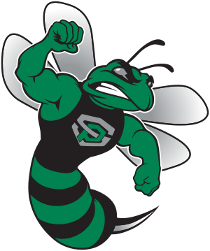
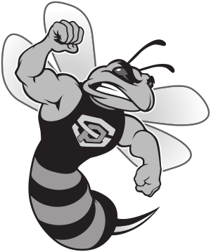
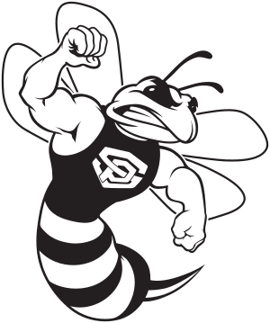
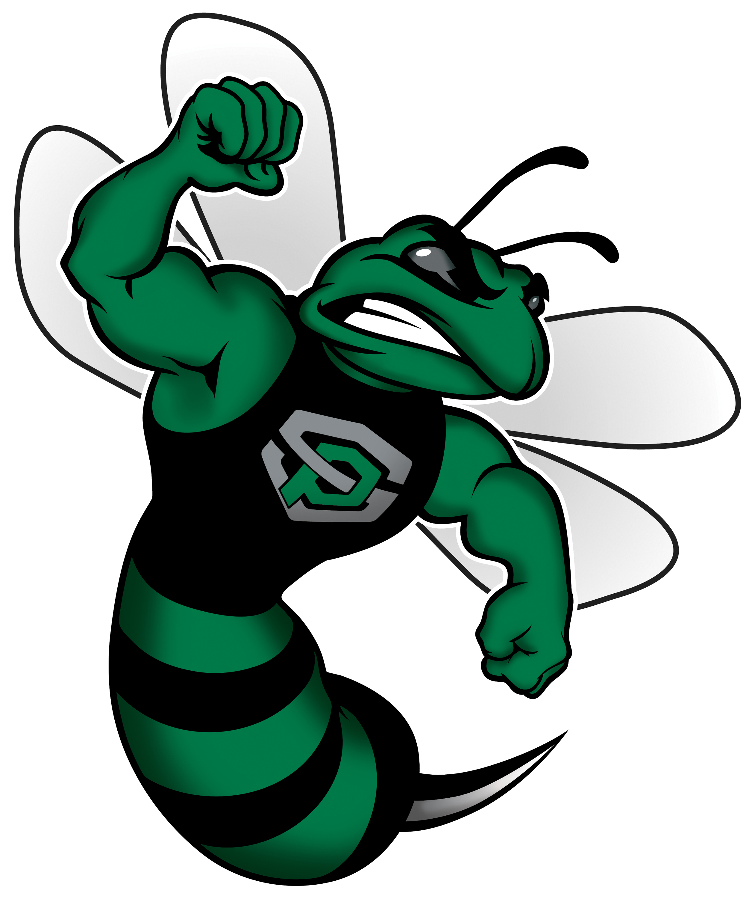
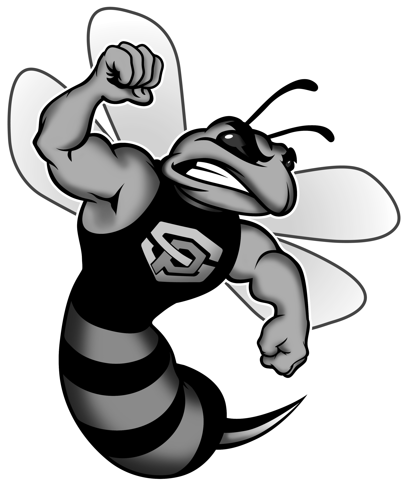
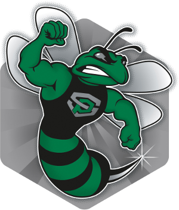

# SPSU Basketball 

Each logo style is available in `svg`, `eps` and `png` formats. Click the link in the table heading to be taken to the
appropriate directory. The `png` images are sized for use in this `README`, please use either the `svg` or `eps` 
formats to maintain resolution in an actual application.

## Hornet

| [Regular](SPSU_Hornet) | [Gray Scale](SPSU_Hornet) | [Line](SPSU_Hornet) |
| ------------- | ------------- | ------------- |
|  |  |  |

## 3D Hornet

| [Regular](SPSU_Hornet) | [Gray Scale](SPSU_Hornet) |
| ------------- | ------------- |
|  |  |

## Shield Hornet

| [Regular](SPSU_Hornet) |
| ------------- |
|  |
