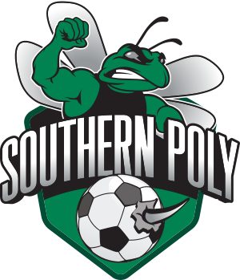
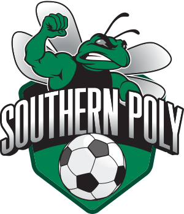
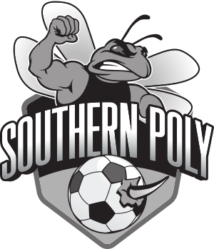
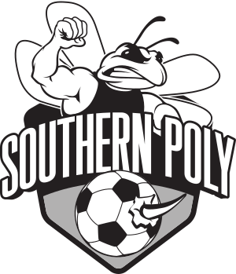
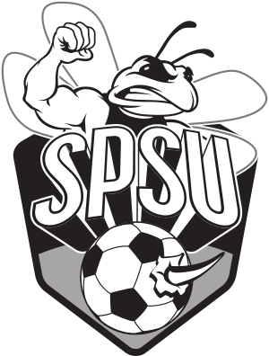

# SPSU Soccer 

Each logo style is available in `svg`, `eps` and `png` formats. Click the link in the table heading to be taken to the
appropriate directory. The `png` images are sized for use in this `README`, please use either the `svg` or `eps` 
formats to maintain resolution in an actual application.

## Hornet

| [Regular](Shield) | [Gray Scale](Shield) | [Line](Shield) |
| ------------- | ------------- | ------------- |
|  |  |  |

## Southern Poly

| [Regular](Southern_Poly) | [Regular 1](Southern_Poly) | [Gray Scale](Southern_Poly) | [Line](Southern_Poly) |
| ------------- | ------------- | ------------- | ------------- |
|  |  |  |  |

## SPSU

| [Regular](SPSU) | [Gray Scale](SPSU) | [Line](SPSU) |
| ------------- | ------------- | ------------- |
|  |  |  |
